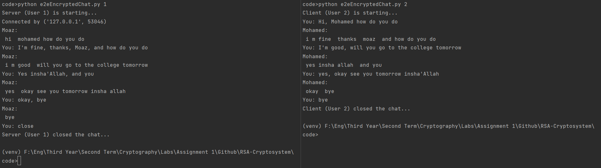
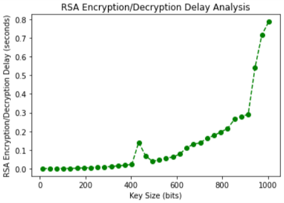
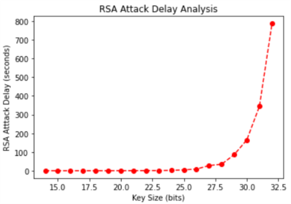

# RSA-Cryptosystem

<h2>Table of Contents</h2>
<ul>
  <li><a href="#built-with--">Built With</a></li>
  <li><a href="#getting-started">Getting Started</a></li>
  <li><a href="#running-from-terminals">Running</a></li>
  <li><a href="#Description">Description</a></li>
  <li><a href="#Screenshots">Screenshots</a></li>
</ul>

<h2 href="#BuiltWith">Built With : </h2>
 <ul>
  <li><a href="https://www.python.org/">Python</a></li>
  <li><a href="https://jupyter.org/">Jupyter Notebook</a></li>
  <li><a href="https://matplotlib.org/">Matplotlib</a></li>
 </ul>

<h2 href="#GettingStarted">Getting Started</h2>
<blockquote>
  
This is a list of needed instructions to set up your project locally, to get a local copy up and running follow these instructions.
 

</blockquote>
<ol>
<li><strong><em>Clone the repository</em></strong>
    

        <code>$ git clone https://github.com/MoazHassan2022/RSA-Cryptosystem.git</code>
    

  </li>
  <li> 
  <strong><em>Navigate to repository directory
</em></strong>
    

        <code>$ cd RSA-Cryptosystem/</code>
    

  </li>
  <li> 
  <strong><em>Install dependencies
</em></strong>
    

        <code>$ python -m pip install -U matplotlib</code>
    

  </li>
</ol>

<h2 href="#Running">Running From Terminals</h2>
<ul>
    <li><strong><em>Open 2 terminals and run following command in first terminal (this is user 1)</em></strong>
    

        <code>$ python e2eEncryptedChat.py 1</code>
    

    </li>
    <li><strong><em>Run following command in second terminal (this is user 2)</em></strong>
    

        <code>$ python e2eEncryptedChat.py 2</code>
    

    </li>
    <li><strong><em>That's it! you can now play safely with our end to end encrypted chat!</em></strong>
    </li>
    <li><strong><em>You can end the chat using the word <code>close</code> at any side.</em></strong>
    </li>
</ul>

<h2 href="#Description">Description</h2>
<blockquote>
  

    This an assignment in encryption/decryption using RSA algorithm and attacking it. 
 

 It is an assignment for Cryptography and Computer Security college course in Computer Engineering Department, Faculty of Engineering, Cairo University. 

 You can see the requirements file in <code>documentation/RSA Assignment.pdf</code>

 You can also see the analysis report file in <code>documentation/Analysis Report.pdf</code>

 This is a documentation video on Youtube, <a href="https://youtu.be/JxT43d5VHV8">Documentation Video</a>

</blockquote>

<h2 href="#Screenshots">Screenshots</h2>
<ol>
<li>
  <h3>e2e encrypted chat example.</h3>
  
</li>
<li>
  <h3>Encryption time Vs. Key size analysis.</h3>
  
</li>
<li>
  <h3>Attacking time Vs. Key size analysis.</h3>
  
</li>
